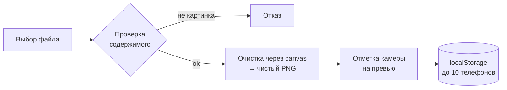

<div align="center">


**Симулятор оптической стабилизации камеры кинематографического уровня.**
Крути телефон, смотри как камера остаётся на месте.

<br>

[](https://jxstab1.github.io/)
[](https://t.me/jxtec)
[](https://t.me/hxxhaa)


<br>

[**Возможности**](#-возможности) ·
[**Свой телефон**](#-добавить-свой-телефон) ·
[**Запуск**](#-запуск) ·
[**Структура**](#-структура-проекта) ·
[**Безопасность**](#-безопасность) ·
[**Контакты**](#-контакты)

</div>

<br>

## ✦ Что это

**StabFX Ultimate** показывает, как работает стабилизация камеры смартфона. Ты вращаешь телефон, а сверху в мини-видоискателе горизонт остаётся ровным, как при настоящем OIS. Точка вращения задаётся по положению камеры на каждом устройстве.

Всё работает в браузере. Без сервера, без регистрации, без установки.

<br>

## ✦ Возможности

<table>
<tr>
<td width="50%" valign="top">

### 📱 Каталог устройств
- **90+ телефонов**: iPhone, Samsung, Xiaomi, Pixel, Huawei, OnePlus, Honor и другие
- У каждого своя **точка стабилизации** и характеристики: процессор и камера
- **Свои телефоны**: до 10 штук, хранятся у тебя в браузере

### 🎛 Управление
- **Джойстик-вращение**: тяни по экрану в любую сторону
- **Auto Spin**: автоматическое вращение
- **Turbo Propeller**: раскрути телефон на заданное время и мощность
- **Растяжение** по ширине от 0.5× до 2×

</td>
<td width="50%" valign="top">

### 🎬 Камера и эффекты
- **HUD видоискателя** с индикатором REC и OIS
- **FX Studio**: снег, буквы JX, падающие телефоны, микс
- **Rage Glow**: вспышка при быстром вращении
- **3D-тени**: наклон телефона за курсором
- **Photo Mode**: красивая карточка с ником, моделью и железом для скриншота

### 🎨 Оформление
- **10 фонов**: Absolute Black, Cyberpunk Neon, Deep Space, Matrix Code, Sunset, Carbon, Blueprint, Dark Wood, Hexagon, Aura Gradient
- **Тёмная и светлая тема**
- **Русский и English**
- **FPS 30 / 60 / 120** и режим **FPS Boost** для слабых устройств
- Музыка на фоне
- Нижнее меню-шторка на телефоне, карточка на десктопе

</td>
</tr>
</table>

<br>

## ✦ Добавить свой телефон

Нет твоей модели в списке? Добавь сам. Это займёт полминуты.

1. Нажми **`+`** в левом верхнем углу
2. Введи **название**, при желании процессор и камеру
3. Выбери **картинку телефона** (лучше PNG с прозрачным фоном, вид сзади)
4. **Нажми на камеру** на превью. Вокруг этой точки телефон будет стабилизироваться
5. **Сохрани**. Готово, телефон появится в списке со звёздочкой ★



| Что | Ограничение |
|---|---|
| Количество своих телефонов | **10** |
| Форматы | PNG, JPG, JPEG, JFIF, WEBP, GIF, BMP, AVIF |
| **Не принимаются** | SVG, HTML, PHP и всё остальное |
| Размер файла | до 8 МБ |
| Где хранятся | только в браузере пользователя, у тебя на сервере ничего нет |

> Точку камеры можно уточнить позже кнопкой **◎** рядом с телефоном в списке.

Хочешь, чтобы телефон попал в **общий каталог**? Пиши [@hxxhaa](https://t.me/hxxhaa).

<br>

## ✦ Запуск

Собирать ничего не нужно. Это обычная статика.

**Онлайн:** открой [демо](https://jxstab1.github.io/).

**Локально:**

```bash
git clone https://github.com/jxstab1/jxstab1.github.io.git
cd jxstab1.github.io

# любой статический сервер
python3 -m http.server 8080
# → http://localhost:8080/OJ!DBWjb1BNsbi!9237.html
```

**На GitHub Pages:** залей файлы в репозиторий `<user>.github.io`, включи Pages в настройках. Готово.

> [!IMPORTANT]
> В начале `app.js` есть защита от копирования. Она срабатывает, если сайт открыт **не на `jxstab1.github.io`** и имя HTML-файла отличается от `OJ!DBWjb1BNsbi!9237.html`. При форке на свой домен поправь эту проверку.

<br>

## ✦ Структура проекта

```text
.
├── OJ!DBWjb1BNsbi!9237.html   # разметка, модальные окна, CSP
├── style.css                  # весь дизайн: тема, светлая тема, 10 фонов
├── app.js                     # логика, каталог телефонов, свои телефоны
├── phones/                    # PNG-картинки встроенных телефонов
│   ├── Iphone16ProMax.png
│   ├── SamsungS25U.png
│   └── ...
├── UNDER_YOUR_SPELL.mp3       # треки для фона
└── REVOLTA_DO_CHAPEU.mp3
```

### Добавить телефон в общий каталог (для разработчика)

1. Положи PNG в `phones/`
2. Добавь запись в `phonesData` в `app.js`:

```js
Iphone16ProMax: {
  image: "phones/Iphone16ProMax.png",
  stabilizationPoint: { x: "50.00%", y: "20.00%" },
  specs: { processor: "A18 Pro", camera: "48MP Fusion" }
},
```

3. Открой сайт, нажми **F12** и в консоли введи `camera()`. Кликни по камере на картинке, код с точными процентами напечатается в консоль. Скопируй его в `phonesData`. Режим выключается командой `off()`.

<br>

## ✦ Безопасность

Свои телефоны вставляет пользователь, поэтому всё, что он вводит и загружает, считается недоверенным.

| Угроза | Защита |
|---|---|
| Загрузка HTML, PHP, SVG под видом картинки | Проверка **расширения и первых байтов файла** (magic bytes), не только MIME |
| Вредоносное содержимое внутри картинки | Картинка **перерисовывается через canvas** в новый чистый PNG |
| XSS через название, процессор, камеру, ник | Очистка символов `< > " ' \` & \`, лимит длины, вывод только через `textContent` |
| Подмена данных в `localStorage` | Все данные **перепроверяются при загрузке**: ссылки на картинки, числа, язык, фон, FX, трек |
| Инъекция через CSS (`transform-origin`) | Координаты точки приводятся к числам 0–100 |
| Внешние скрипты и inline-код | **Content-Security-Policy**: скрипты только с `self` и `cdn.jsdelivr.net`, `object-src 'none'` |
| Перехват через внешние ссылки | `rel="noopener noreferrer"` |

Нашёл дыру? Напиши в [Telegram](https://t.me/hxxhaa), не публикуй в Issues.

<br>

## ✦ Технологии

| | |
|---|---|
| **Ядро** | HTML5, CSS3, Vanilla JavaScript, без фреймворков и сборки |
| **Частицы** | [tsParticles](https://particles.js.org/) 2.9.3 |
| **Иконки** | [Font Awesome](https://fontawesome.com/) 6.4 |
| **Шрифты** | Bricolage Grotesque, IBM Plex Mono |
| **Хранилище** | `localStorage`: настройки, язык, свои телефоны |

<br>

## ✦ Планы

- [x] 90+ телефонов в каталоге
- [x] Свои телефоны с выбором точки камеры
- [x] Светлая тема, 10 фонов, RU/EN
- [ ] Новые устройства из комментариев и реакций
- [ ] Экспорт и импорт своих телефонов файлом
- [ ] Больше эффектов в FX Studio

> **100 реакций на канале = новое обновление.** Ставь 🔥 под постами в [@jxtec](https://t.me/jxtec).

<br>

## ✦ Контакты

<div align="center">

| Роль | Кто |
|---|---|
| 💻 Разработка | [@hxxhaa](https://t.me/hxxhaa) |
| 🔎 Поиск и тесты | [@romafacti1](https://t.me/romafacti1) |
| 📣 Канал | [@jxtec](https://t.me/jxtec) |

Поддержать разработку можно по реквизитам на самом сайте.

<br>

**Сделано для тех, кто любит смотреть, как стабилизация работает.**

<sub>StabFX Ultimate · by hxxhaa</sub>

</div>
